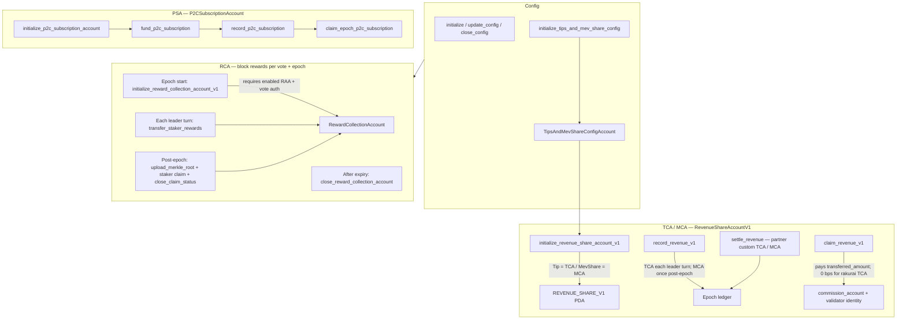
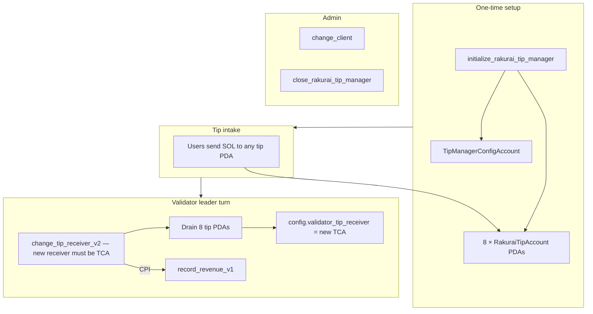
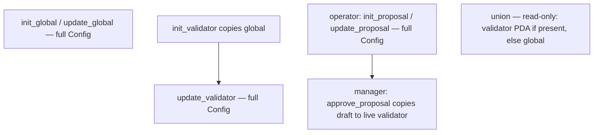
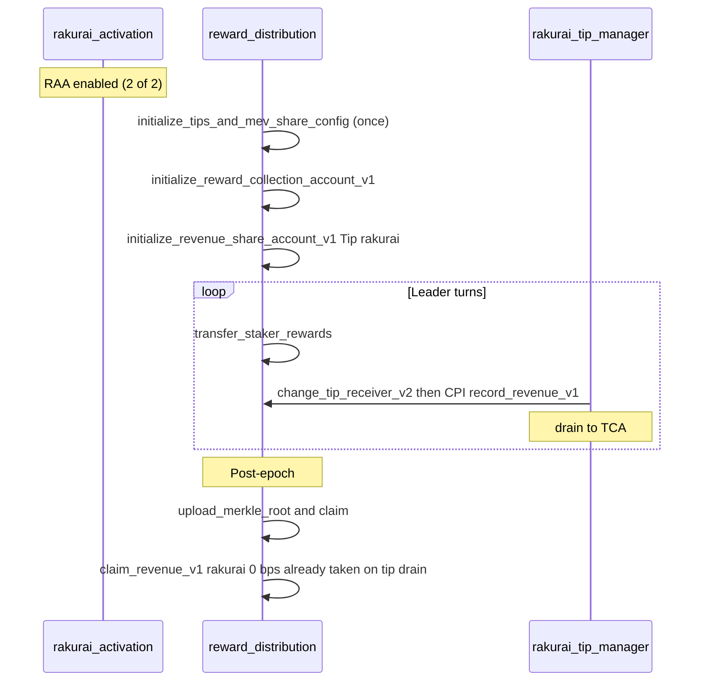

# Program Procedure Flow Diagrams

High-level procedure flows for Rakurai on-chain programs. Production is **V1 only**. Reward Distribution has **four revenue models**: RCA, TCA, MCA, PSA.

---

## 1. Rakurai Activation

One **config PDA** (global) and one **RAA PDA** per validator identity. Multisig-style enable/disable for the Rakurai scheduler.

| Step | Instruction | Who |
|------|-------------|-----|
| Global config | `initialize` / `update_config` | config authority |
| Create RAA | `initialize_rakurai_activation_account` | validator identity |
| Enable | `update_rakurai_activation_approval` (propose → approve) | validator + Rakurai |
| Disable | `update_rakurai_activation_approval` | validator **or** Rakurai |
| Commission | `update_rakurai_activation_commission` | validator |
| Close RAA | `close_rakurai_activation_account` | client authority |

---

## 2. Reward Distribution — RCA, TCA, MCA, PSA

Per-epoch **RCA** for block rewards (Merkle staker claims). Independent money paths: **TCA** (tips), **PSA** (prepaid P2C subscription), **MCA** (post-pack backrun share).

| Path | Phase | Instructions |
|------|-------|--------------|
| RCA | Epoch start | `initialize_reward_collection_account_v1` |
| RCA | Leader turns | `transfer_staker_rewards`, optional MEV commission ix |
| RCA | Post-epoch | `upload_merkle_root`, `claim`, `close_claim_status` |
| RCA | Cleanup | `close_reward_collection_account` |
| Tips/Mev config | Setup | `initialize_tips_and_mev_share_config` / `update_*` |
| TCA / MCA | Setup | `initialize_revenue_share_account_v1` |
| TCA / MCA | Record / settle / claim | `record_revenue_v1`, `settle_revenue`, `claim_revenue_v1` |
| PSA | Fund / record / claim | `fund_p2c_subscription`, `record_p2c_subscription`, `claim_epoch_p2c_subscription` |

**TCA / MCA PDA:** `[REVENUE_SHARE_V1, TIP|MEV_SHARE, name, vote]`

**PSA PDA:** `[P2C_SUBSCRIPTION, name, vote]`

---

## 3. Rakurai Tip Manager

Global **8 tip PDAs** + singleton config. Validators drain on leader turns into the Rakurai **TCA**.

| Step | Instruction | Who |
|------|-------------|-----|
| Deploy | `initialize_rakurai_tip_manager` | payer (once) |
| Drain | `change_tip_receiver_v2` | Rakurai-enabled validator |
| Rotate client | `change_client` | config authority |
| Shutdown | `close_rakurai_tip_manager` | config authority |

**Corner cases:** Drain credits `old_tip_receiver`, not `new_tip_receiver`. First drain after tip-manager init credits init payer until config already points at a TCA.

---

## 4. Client Config

Scheduler **endpoints and virtual-priority tip maps** only (not money). Every write **replaces the entire `Config`** — submit **current + new**.

---

## Cross-program sequence (validator epoch)

