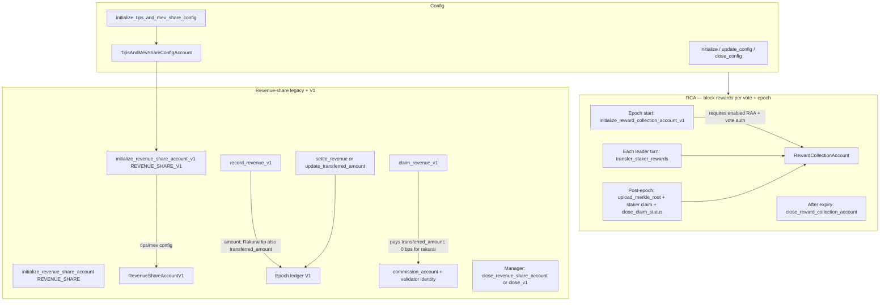
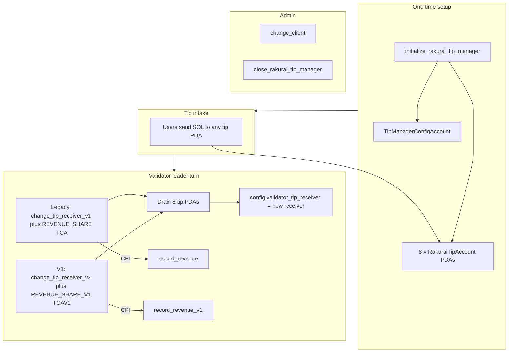
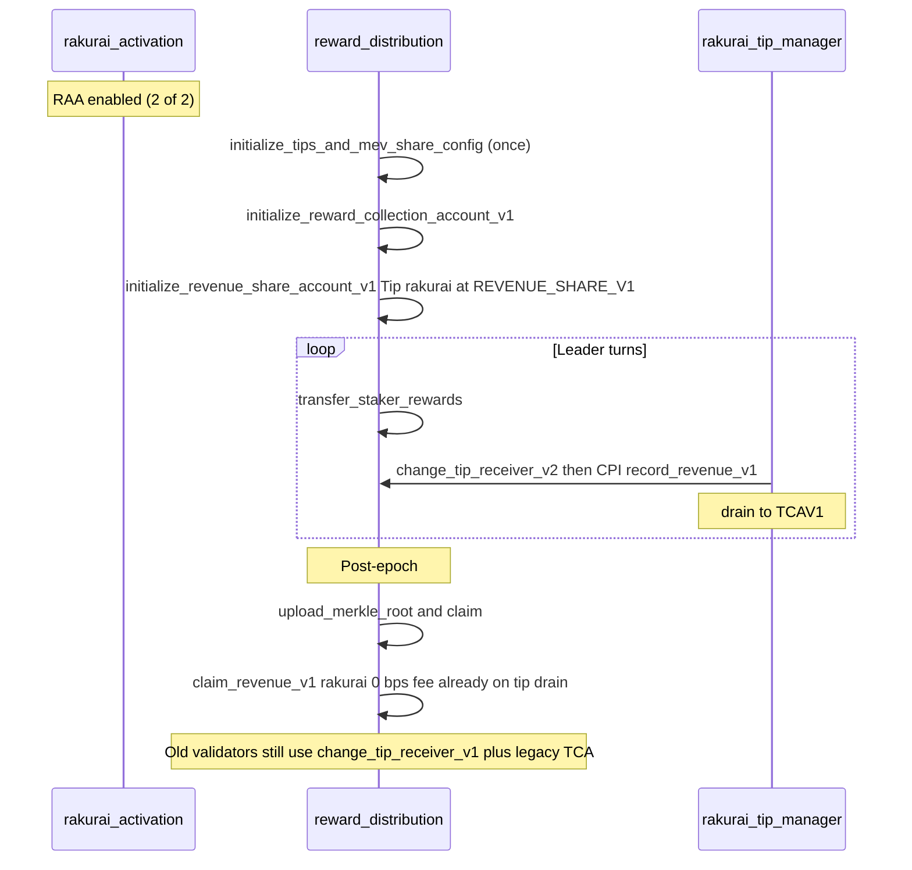

# Program Procedure Flow Diagrams

High-level procedure flows for the three Rakurai on-chain programs.

---

## 1. Rakurai Activation

One **config PDA** (global) and one **RAA PDA** per validator identity. Multisig-style enable/disable for the Rakurai scheduler.

| Step | Instruction | Who |
|------|-------------|-----|
| Global config | `initialize` / `update_config` | config authority |
| Create RAA | `initialize_rakurai_activation_account` | validator identity |
| Enable | `update_rakurai_activation_approval` (propose → approve) | validator + Rakurai |
| Disable | `update_rakurai_activation_approval` | validator **or** Rakurai |
| Commission | `update_rakurai_activation_commission` | validator |
| Close RAA | `close_rakurai_activation_account` | client authority |

---

## 2. Reward Distribution — RCA & Revenue-Share Accounts

Per-epoch **RCA** for block rewards (Merkle staker claims) and per-validator **revenue-share vaults** for tip/mev-share attribution.

| Path | Phase | Instructions |
|------|-------|--------------|
| RCA | Epoch start | `initialize_reward_collection_account_v1` |
| RCA | Leader turns | `transfer_staker_rewards`, optional MEV commission ix |
| RCA | Post-epoch | `upload_merkle_root`, `claim`, `close_claim_status` |
| RCA | Cleanup | `close_reward_collection_account` |
| Tips/Mev config | Setup | `initialize_tips_and_mev_share_config` / `update_tips_and_mev_share_config` |
| Revenue legacy | Setup / record / claim / close | `initialize_revenue_share_account`, `record_revenue`, `claim_revenue`, `close_revenue_share_account` |
| Revenue V1 | Setup | `initialize_revenue_share_account_v1` |
| Revenue V1 | Leader / settle / claim | `record_revenue_v1`, `settle_revenue`, `claim_revenue_v1` |
| Revenue V1 | Admin | `update_deficit`, `close_revenue_share_account_v1` |

**Legacy PDA:** `[REVENUE_SHARE, TIP|MEV_SHARE, name, vote]` — old validators + TM `change_tip_receiver_v1`.

**V1 PDA:** `[REVENUE_SHARE_V1, TIP|MEV_SHARE, name, vote]` — TCAV1 layout (`transferred_amount`, `deficit`); TM `change_tip_receiver_v2`.

---

## 3. Rakurai Tip Manager

Global **8 tip PDAs** + singleton config. Validators drain on leader turns; config receiver rotates to tip revenue-share PDA.

| Step | Instruction | Who |
|------|-------------|-----|
| Deploy | `initialize_rakurai_tip_manager` | payer (once) |
| Drain legacy | `change_tip_receiver_v1` | old validators |
| Drain V1 | `change_tip_receiver_v2` | new validators |
| Rotate client | `change_client` | config authority |
| Shutdown | `close_rakurai_tip_manager` | config authority |

**Corner cases:** Drain credits `old_tip_receiver`, not `new_tip_receiver`. First drain after tip-manager init credits init payer until config already points at a TCA.

---

## Cross-program sequence (validator epoch)

