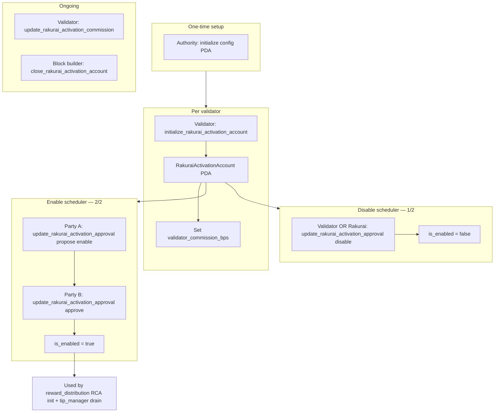
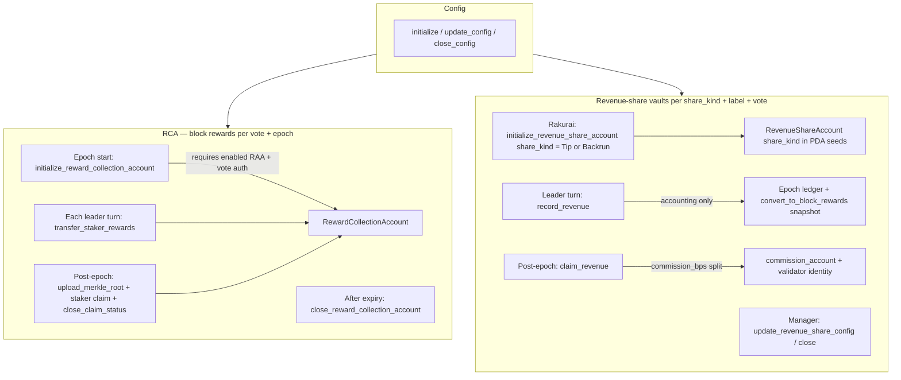
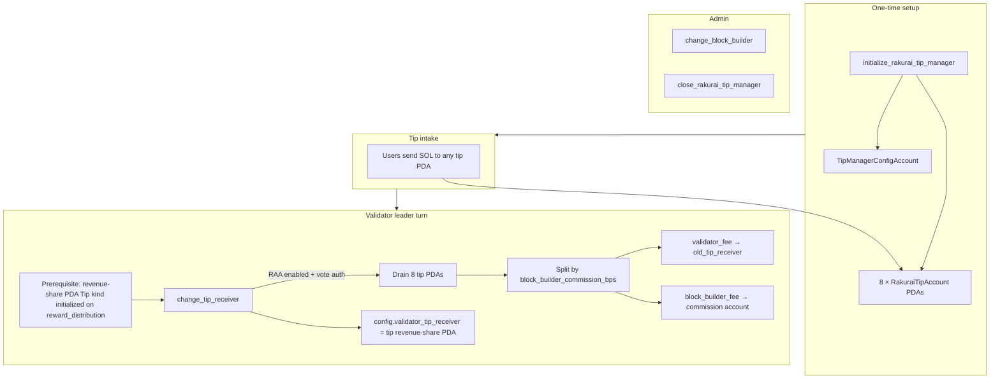
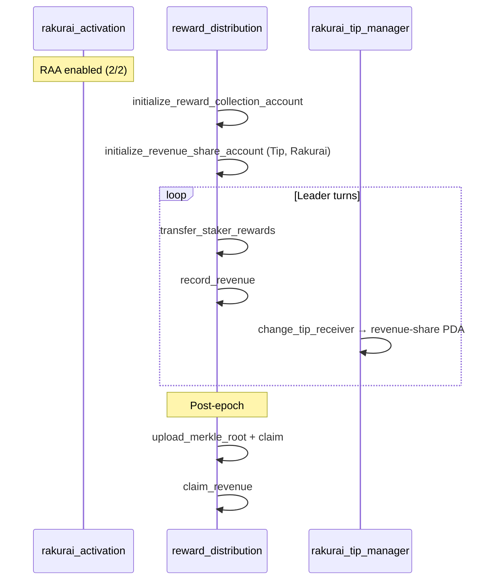

# Program Procedure Flow Diagrams

High-level procedure flows for the three Rakurai on-chain programs on `feature/tip_distribution`.

---

## 1. Rakurai Activation

One **config PDA** (global) and one **RAA PDA** per validator identity. Multisig-style enable/disable for the Rakurai scheduler.

| Step | Instruction | Who |
|------|-------------|-----|
| Global config | `initialize` / `update_config` | config authority |
| Create RAA | `initialize_rakurai_activation_account` | validator identity |
| Enable | `update_rakurai_activation_approval` (propose → approve) | validator + Rakurai |
| Disable | `update_rakurai_activation_approval` | validator **or** Rakurai |
| Commission | `update_rakurai_activation_commission` | validator |
| Close RAA | `close_rakurai_activation_account` | block builder authority |

---

## 2. Reward Distribution — RCA & Revenue-Share Accounts

Per-epoch **RCA** for block rewards (Merkle staker claims) and per-validator **revenue-share vaults** for tip/backrun attribution.

| Path | Phase | Instructions |
|------|-------|--------------|
| RCA | Epoch start | `initialize_reward_collection_account` |
| RCA | Leader turns | `transfer_staker_rewards`, optional MEV commission ix |
| RCA | Post-epoch | `upload_merkle_root`, `claim`, `close_claim_status` |
| RCA | Cleanup | `close_reward_collection_account` |
| Revenue | Setup | `initialize_revenue_share_account` (`share_kind` arg) |
| Revenue | Leader turns | `record_revenue` |
| Revenue | Post-epoch | `claim_revenue` |
| Revenue | Admin | `update_revenue_share_config`, `close_revenue_share_account` |

Revenue-share PDA seeds: `[REVENUE_SHARE, share_kind ("TIP" \| "BACKRUN"), name, validator_vote]`. One unified `RevenueShareAccount` (aliases `TipsCollectionAccount` (TCA) / `BackrunCollectionAccount` (BCA)); `share_kind` selects Tip vs Backrun. Claim requires revenue-share PDA lamports ≥ ledger amount.

---

## 3. Rakurai Tip Manager

Global **8 tip PDAs** + singleton config. Validators drain on leader turns; config receiver rotates to tip revenue-share PDA.

| Step | Instruction | Who |
|------|-------------|-----|
| Deploy | `initialize_rakurai_tip_manager` | payer (once) |
| Drain + rotate | `change_tip_receiver` | Rakurai-enabled validator |
| Rotate builder | `change_block_builder` | config authority |
| Shutdown | `close_rakurai_tip_manager` | config authority |

**Corner cases:** Current drain credits `old_tip_receiver`, not `new_tip_receiver`. First drain after tip-manager init credits init payer until config already points at the revenue-share PDA. Revenue-share vault must exist before `change_tip_receiver` succeeds.

---

## Cross-program sequence (validator epoch)

